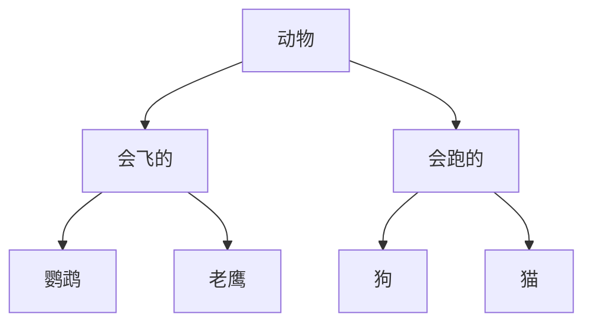

封装、继承和多态只是面向对象程序设计中最基础的3个概念。在Python中，面向对象还有很多高级特性，下面会讨论多重继承、定制类、元类等概念。

<!-- more -->

# 使用 __slots__

正常情况下，可以给一个类的实例创建任何属性和方法，这就是动态语言的灵活性。

```python
class Student(object):
    pass
    
```

绑定属性

```shell
>>> s = Student()
>>> s.name = 'Michael' # 动态给实例绑定一个属性
>>> print(s.name)
Michael

```
也可以绑定一个方法

```shell
>>> def set_age(self, age): # 定义一个函数作为实例方法
...     self.age = age
...
>>> from types import MethodType
>>> s.set_age = MethodType(set_age, s) # 给实例绑定一个方法
>>> s.set_age(25) # 调用实例方法
>>> s.age # 测试结果
25
```
给实例绑定的方法，对另一个实例无效，所以可以绑定到类上。

```shell
>>> def set_score(self, score):
...     self.score = score
...
>>> Student.set_score = set_score
```
通常情况下，上面的`set_score`方法可以直接定义在class中，但动态绑定允许我们在程序运行的过程中动态给class加上功能，这在静态语言中很难实现。

**使用__slots__**

如果我们想要限制实例的属性怎么办？比如，只允许对`Student`实例添加`name`和`age`属性。

为了达到限制的目的，Python允许在定义class的时候，定义一个特殊的`__slots__`变量，来限制该class实例能添加的属性：

`__slots__`定义的属性仅对当前类实例起作用，对继承的子类是不起作用的。子类实例允许定义的属性就是自身的`__slots__`加上父类的`__slots__`。

验证如下:

```python
class Person(object):
    __slots__ = ('name', 'age')

p1 = Person()
p1.name = '张三'

print(p1.name)
# 添加score属性会报错
#p1.score = 10

class Student(Person):
    __slots__ = ('class', 'score')

s1 = Student()

s1.name = '小明'
s1.age = '14'
s1.score = 98

print(s1.name, s1.age, s1.score)

```
# 使用@property

如果给属性加上访问限制，使用get set方法，也可以在赋值时检查数据的合理性。这样操作略显复杂。

Python内置的`@property`装饰器就是负责把一个方法变成属性调用的

把一个getter方法变成属性，只需要加上`@property`就可以了。我们在对实例属性操作的时候，就知道该属性很可能不是直接暴露的，而是通过getter和setter方法来实现的。

```python
class Student(object):

    @property
    def birth(self):
        return self._birth

    @birth.setter
    def birth(self, value):
        self._birth = value

    @property
    def age(self):
        return 2015 - self._birth
```
只定义getter方法，不定义setter方法就是一个只读属性，上面的`birth`是可读写属性，而`age`就是一个只读属性，因为`age`可以根据`birth`和当前时间计算出来。

要特别注意：属性的方法名不要和实例变量重名，下面的就是错误的。

```python
class Student(object):

    # 方法名称和实例变量均为birth:
    @property
    def birth(self):
        return self.birth
```

这是因为调用`s.birth`时，首先转换为方法调用，在执行`return self.birth`时，又视为访问`self`的属性，于是又转换为方法调用，造成无限递归，最终导致栈溢出报错`RecursionError`

# 多重继承


如果是单继承的话，层级结构如下。



如果需要再添加新的继承关系，就会很复杂了， 所以可以采用多重继承的方式。 比如

```python
class Dog(Mammal, Runnable):
    pass
```
通过多重继承，一个子类就可以同时获得多个父类的所有功能。

**MixIn**

在设计类的继承关系时，通常，主线都是单一继承下来的，例如，`Ostrich`继承自`Bird`。但是，如果需要“混入”额外的功能，通过多重继承就可以实现，比如，让`Ostrich`除了继承自`Bird`外，再同时继承`Runnable`。这种设计通常称之为`MixIn`。

MixIn的目的就是给一个类增加多个功能，这样，在设计类的时候，我们优先考虑通过多重继承来组合多个MixIn的功能，而不是设计多层次的复杂的继承关系。

由于Python允许使用多重继承，因此，MixIn就是一种常见的设计。

java中只允许单继承，但是可以通过 implements 多个接口来实现类似的功能。

# 定制类

看到类似`__slots__`这种形如`__xxx__`的变量或者函数名就要注意，这些在Python中是有特殊用途的。

`__slots__` 用于限制实例的属性

`__len__()` 让类作用于`len()`函数

Python的class中还有许多这样有特殊用途的函数，可以帮助我们定制类。

`__str__`

类似java的 `toString()`方法， 自定义对象的输出信息。可以将实例内部的信息输出。

`__str__()`返回用户看到的字符串，而`__repr__()`返回程序开发者看到的字符串(对象的内存地址信息等),比如`<__main__.Student object at 0x000001A342D19F70>`，也就是说 `__repr__()`是为调试服务的。

`__iter__`

如果一个类想被用于`for ... in`循环，类似`list`或`tuple`那样，就必须实现一个`__iter__()`方法，该方法返回一个迭代对象，然后，Python的for循环就会不断调用该迭代对象的`__next__()`方法拿到循环的下一个值，直到遇到StopIteration错误时退出循环。

```python
class Fib(object):
    def __init__(self):
        self.a, self.b = 0, 1 # 初始化两个计数器a，b

    def __iter__(self):
        return self # 实例本身就是迭代对象，故返回自己

    def __next__(self):
        self.a, self.b = self.b, self.a + self.b # 计算下一个值
        if self.a > 100000: # 退出循环的条件
            raise StopIteration()
        return self.a # 返回下一个值
```

`__getitem__`

如果需要像list那样按照下标取元素，就需要实现`__getitem__()`方法

```python
class Fib(object):
    def __getitem__(self, n):
        a, b = 1, 1
        for x in range(n):
            a, b = b, a + b
        return a
```

如果把对象看成`dict`，`__getitem__()`的参数也可能是一个可以作key的object，例如`str`

与之相对应的是 `__setitem__()`，把对象当做list或者dict来进行赋值，`__delitem__()` 用于删除某个元素。

`__getattr__`

正常情况下，当我们调用类的方法或属性时，如果不存在，就会报错。Python提供了一个机制，那就是写一个`__getattr__()`方法，动态返回一个属性或者函数。

这就可以把一个类的所有属性和方法调用全部动态化处理了，不需要任何特殊手段。

这种特性可以用来针对完全动态的情况作调用。比如 url中的动态路径。

`__call__`

我们用`instance.method()`来调用对象的方法，也可以在实例本身上调用，需要定义一个`__call__()`方法即可。

```python
class Student(object):
    def __init__(self, name):
        self.name = name

    def __call__(self):
        print('My name is %s.' % self.name)
```

`__call__()`还可以定义参数。对实例进行直接调用就好比对一个函数进行调用一样。

如果你把对象看成函数，那么函数本身其实也可以在运行期动态创建出来，因为类的实例都是运行期创建出来的，这么一来，我们就模糊了对象和函数的界限。

判断一个对象是否能被调用，能被调用的对象就是一个`Callable`对象，通过`callable()` 函数判断对象是否是"可调用"的对象

```shell
>>> callable(str)
True
>>> callable(int)
True
>>> callable(None)
False
>>> callable((1,2,3,4))
False
>>>
```

# 枚举类

当我们定义常量时，简单的方法是用大写变量通过常数来定义，但是缺点是类型是`int`， 并且依然是变量。

更好的方法是使用`Enum`来定义一个枚举类。

```python
from enum import Enum

Month = Enum('Month', ('Jan', 'Feb', 'Mar', 'Apr', 'May', 'Jun', 'Jul', 'Aug', 'Sep', 'Oct', 'Nov', 'Dec'))
```
我们可以使用`Month.Jan`来引用一个常量。

```python
for name, member in Month.__members__.items():
    print(name, '=>', member, ',', member.value)
```

`value`属性则是自动赋给成员的`int`常量，默认从`1`开始计数。

如果需要更精确地控制枚举类型，可以从`Enum`派生出自定义类：

```python
from enum import Enum, unique

@unique
class Weekday(Enum):
    Sun = 0 # Sun的value被设定为0
    Mon = 1
    Tue = 2
    Wed = 3
    Thu = 4
    Fri = 5
    Sat = 6
```

访问方式有下面几种

```shell
>>> print(Weekday.Sun)
Weekday.Sun
>>> print(Weekday['Sun'])
Weekday.Sun
>>> print(Weekday(1))
Weekday.Mon
>>>
>>> print(Weekday(1).value)
1
>>>
>>> day1 = Weekday.Sun
>>> print(day1 == Weekday(1))
False
>>> print(day1 == Weekday(0))
True
>>>
>>> print(day1 == Weekday['Sun'])
True
>>> print(day1 == Weekday.Sun)
True
>>>

```

# 元类

> 元类就是深度的魔法，99% 的用户应该根本不必为此操心。如果你想搞清楚究竟是否需要用到元类，那么你就不需要它。那些实际用到元类的人都非常清楚地知道他们需要做什么，而且根本不需要解释为什么要用元类。

**type()**

动态语言和静态语言最大的不同，就是函数和类的定义，不是编译时定义的，而是运行时动态创建的。

比方说我们要定义一个`Hello`的class，就写一个`hello.py`模块：

```shell
class Hello(object):
    def hello(self, name='world'):
        print('Hello, %s.' % name)
```

当Python解释器载入`hello`模块时，就会依次执行该模块的所有语句，执行结果就是动态创建出一个`Hello`的class对象，测试如下：

```shell
>>> from hello import Hello
>>> h = Hello()
>>> h.hello()
Hello, world.
>>> print(type(Hello))
<class 'type'>
>>> print(type(h))
<class 'hello.Hello'>
```

`type()`函数可以查看一个类型或变量的类型，`Hello`是一个class，它的类型就是`type`，而`h`是一个实例，它的类型就是class `Hello`。

我们说class的定义是运行时动态创建的，而创建class的方法就是使用`type()`函数。

**metaclass**

除了使用type()动态创建类以外，要控制类的创建行为，还可以使用metaclass。