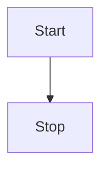
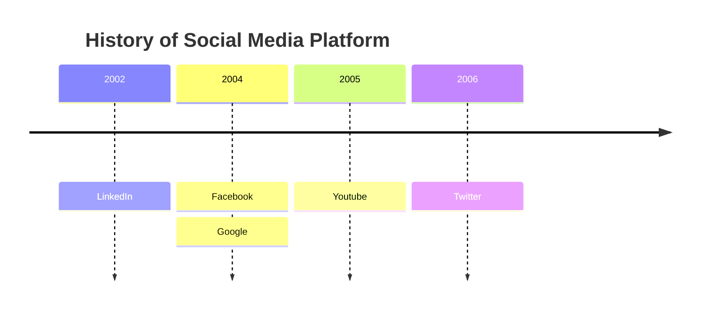

主要介绍hexo的配置，和使用next主题时的一些自定义配置，需要先确认版本是否一致。
本文主要基于 hexo 7.0.0 和 next 8.18.2，如果版本不一致，可能会有报错。

<!-- more -->


## hexo安装配置

操作比较简单，可以直接参考官方文档  [hexo配置](https://hexo.io/zh-cn/docs/configuration)


## 版本说明

版本依赖

````properties
$ npm list
hexo-site@0.0.0 D:\Documents\GitHub\hexo
├── @waline/hexo-next@3.0.1
├── hexo-cli@4.3.1
├── hexo-deployer-git@4.0.0
├── hexo-generator-archive@2.0.0
├── hexo-generator-category@2.0.0
├── hexo-generator-index@3.0.0
├── hexo-generator-searchdb@1.4.1
├── hexo-generator-tag@2.0.0
├── hexo-renderer-ejs@2.0.0
├── hexo-renderer-marked@6.1.1
├── hexo-renderer-stylus@3.0.0
├── hexo-server@3.0.0
├── hexo-symbols-count-time@0.7.1
├── hexo-theme-landscape@1.0.0
├── hexo-theme-next@8.18.2
└── hexo@7.0.0

````

### 版本升级

1. 先检查hexo版本， hexo version ，如果不对，可以 `npm install -g hexo-cli` 全局升级。然后再次查看版本是否升级成功
2. 使用npm-check，检查项目依赖的插件是否需要升级。
3. 使用npm-upgrade，升级依赖的插件。
4. npm update -g，更新全局插件。

```shell
npm install -g hexo-cli
hexo version

npm install -g npm-check
npm-check

npm install -g npm-upgrade
npm-upgrade

npm update -g

hexo clean && hexo g && hexo s
```

## Next主题配置
主要是修改themes/next 文件夹内的`_config.yml` 文件里面的配置

[参考官方文档](https://theme-next.iissnan.com/getting-started.html)

### 开启阅读时长
1. npm安装插件

> npm install hexo-symbols-count-time -g

2. 修改hexo的主配置，添加

```
symbols_count_time:
  symbols: true
  time: true
  total_symbols: true
  total_time: true
  exclude_codeblock: false
  awl: 3
  wpm: 200
  suffix: "mins."
```
3. 查看next的配置文件中的内容

```
symbols_count_time:
  separated_meta: true
  item_text_post: true
  item_text_total: false
```
4. 配置完成后，需要执行 hexo clean，否则阅读时长可能会显示 NaN

>  hexo clean && hexo g && hexo s

### 搜索功能

1. 安装插件 

> npm install hexo-generator-searchdb

2. 开启next的搜索配置

```properties
local_search:
  enable: true

```

### 开启访问数统计

开启配置

```yaml
busuanzi_count:
  enable: true
```

### 添加评论系统

经过网上的查询和综合评估，选择了[waline](https://waline.js.org/guide/get-started/) 作为评论系统。

1. 首先需要注册和部署相关应用， 可以直接参考官方文档 [waline get-started](https://waline.js.org/guide/get-started/)

2. 由于 Next 主题中没有 Waline 的评论配置，需要安装官方的插件，在目录下执行

> npm install @waline/hexo-next

3. 在next主题的配置下面添加, 一定要修改 serverURL 为自己的

```yaml
# Waline
# For more information: https://waline.js.org, https://github.com/walinejs/waline
waline:
  enable: true #是否开启
  serverURL: 填写第一步部署后获取到的地址 # Waline #服务端地址，我们这里就是上面部署的 Vercel 地址
  placeholder: 请文明评论呀 # #评论框的默认文字
  avatar: mm # 头像风格
  meta: [nick, mail, link] # 自定义评论框上面的三个输入框的内容
  pageSize: 10 # 评论数量多少时显示分页
  lang: zh-cn # 语言, 可选值: en, zh-cn
  # Warning: 不要同时启用 `waline.visitor` 以及 `leancloud_visitors`.
  visitor: false # 文章阅读统计
  comment_count: true # 如果为 false , 评论数量只会在当前评论页面显示, 主页则不显示
  requiredFields: [] # 设置用户评论时必填的信息，[nick,mail]: [nick] | [nick, mail]
  libUrl: # Set custom library cdn url

```

4. 重新生成

>  hexo clean && hexo g && hexo s

### 登录注册评论后台

Waline 有服务端，支持评论管理。找到评论框，点击 登录 按钮，会弹出一个窗口，找到用户注册，默认第一个注册的用户为管理员，所以部署好一定要记得及时注册。

注册登录之后， 就可以对评论进行管理了。


### hexo开启 mermaid

`mermaid` 可以帮助在markdown中画流程图，时序图等

首先需要在项目目录下面安装依赖

>  npm i hexo-filter-mermaid-diagrams

然后在配置中开启

```yaml
mermaid:
  enable: true
```

下面就可以在markdown文件中添加对应的内容，页面就会自动渲染了， 如下面的例子


**流程图**


````yaml
mermaid
graph TD
Start --> Stop
````




**时间轴**


